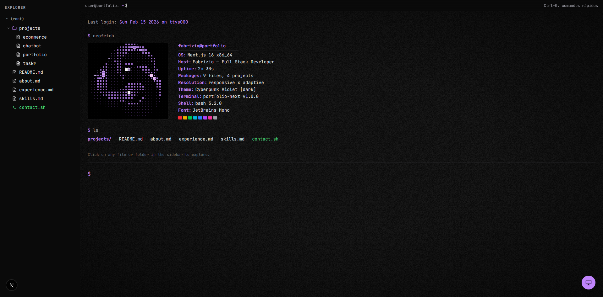
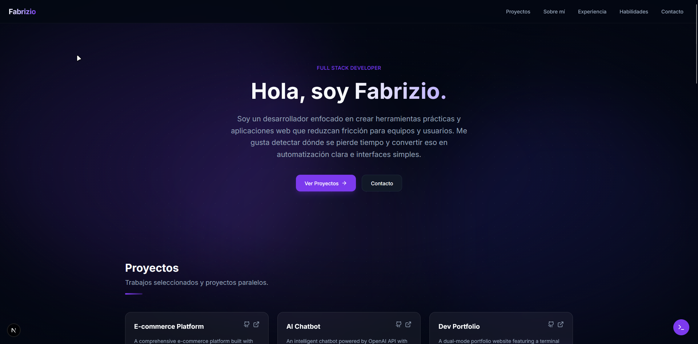

# Portfolio Dual UI (Terminal + Modern)

Portfolio personal con dos experiencias de navegación: una terminal interactiva para perfil técnico y una interfaz moderna orientada a reclutadores/equipos de producto.

- Live: `https://portfolio-fabrizio.vercel.app/`
- Stack base: Next.js 16 + TypeScript + Tailwind CSS v4 + Framer Motion

## Capturas

### Modo Terminal



### Modo Moderno



## Características
- Dual mode real: cambio entre `terminal` y `gui` con transición animada.
- Terminal interactiva: file tree navegable, vistas de carpeta/archivo/script y prompt simulado.
- Modo moderno: hero, proyectos, about, experiencia, skills y contacto con navegación por secciones.
- Data centralizada: contenido compartido entre ambos modos desde `src/lib/data.ts`.
- Efectos visuales: CRT, scanlines, ruido y escena ASCII con fallback y ajustes de performance.
- Accesibilidad mejorada: navegación por teclado, modal con foco controlado, soporte `prefers-reduced-motion`.
- Quality gates: workflow de CI con `lint` + `build`.

## Estado actual
- Build estable en `main`.
- Deploy activo en Vercel.
- README actualizado según la versión actualmente desplegada.

## Stack
- Core: `next@16`, `react@19`, `typescript`
- Styling: `tailwindcss@4`, `clsx`, `tailwind-merge`
- Motion/UI: `framer-motion`, `lucide-react`
- 3D/effects: `three`, `@react-three/fiber`, `@react-three/drei`, `@react-three/postprocessing`, `postprocessing`
- Content render: `react-markdown`, `remark-gfm`, `rehype-highlight`
- E2E toolchain: `@playwright/test` (config liviana: headless y artefactos off)

## Arquitectura
- Fuente de verdad: `src/lib/data.ts`
  - `fileSystem`: estructura recursiva para sidebar terminal
  - `projects`: data de proyectos consumida en terminal y modo moderno
  - `fileContents`: contenido de archivos markdown/scripts
  - `modern`: bloques de about/skills/contact del modo moderno
- Estado global:
  - `src/context/ViewModeContext.tsx`
  - `src/context/ActiveFileContext.tsx`
- Separación de UI:
  - `src/components/terminal/*`
  - `src/components/modern/*`
  - `src/components/effects/*`

## Desarrollo local
```bash
npm install
npm run dev
```

App en `http://localhost:3000`.

## Scripts
```bash
npm run dev     # desarrollo
npm run lint    # eslint
npm run build   # build de produccion
npm run start   # servir build
```

## Calidad y verificacion
- Lint y build deben pasar antes de merge/push.
- Unit/integration tests aun no estan configurados como gate obligatorio.
- E2E aun no es gate obligatorio; la adopcion es incremental.
- CI en `.github/workflows/ci.yml` ejecuta:
  - `npm ci`
  - `npm run lint`
  - `npm run build`

## Playwright (reglas del proyecto)
Tooling presente para adopcion incremental, con configuracion orientada a ejecucion liviana:
- `headless: true`
- `screenshot: 'off'`
- `video: 'off'`
- `trace: 'off'`

Estado actual: no hay suite E2E obligatoria en CI.

Ver `playwright.config.ts`.

## Roadmap (pendiente)
- Reemplazar contenido template por contenido final en `src/lib/data.ts`.
- Ajustes SEO/metadata finales.
- Ampliar cobertura E2E de flujos criticos (modo, modal, navegacion).

## Licencia
Uso personal.
